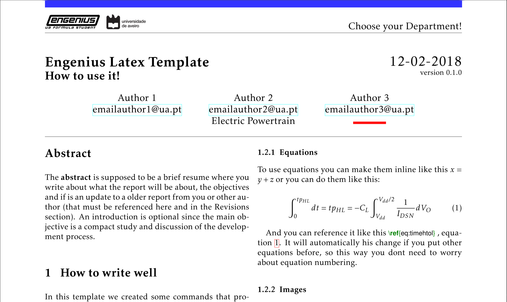

<p align="center">
<a href="https://www.latex-project.org/" target="_blank"></a>

Magda is a Report Latex Template created thinking about non LaTeX users, providing easy writing and commands for people without any knowledge about TeX or LaTeX.
</p>

## Preview

<a href="./docs/example.pdf" target="_blank"></a>

</p>

## How to use the template

The most practical way to learn how to use the template is by opening in your editor of preference and analyze the code already provided or by creating a new project with the template in overleaf. In the template will be a step by step guide how to work with it.

### Abstract

The __abstract__ is supposed to be a brief resume of what the report will be about and the objectives.

### Writing suggestions

#### Equations

To use equations you can make them inline like this `$x = y + z$` or you can do them like this:

```latex
\begin{equation}\label{eq:timehtol}
    \int_{0}^{tp_{HL}}dt = tp_{HL} = -C_L \int_{V_{dd}}^{V_{dd}/2}\frac{1}{I_{DSN}} dV_O
\end{equation}
```

And you can reference it like this `equation~\ref{eq:timehtol}`. It will automatically change if you put other equations before, so this way you don't need to worry about numbering.

#### Images

Images are placed like the example bellow. You can tune the width to make it fit your needs, it can take any units (cm, in, em ...). To reference an image you can follow the same approach as in equations: `image~\ref{img:engeniuslogo}`.

```latex
\begin{figure}[H]
    \begin{center}
        \includegraphics[width=\textwidth/3]{src/engeniusLogo.png}
        \caption{Engenius Image Example}
        \label{img:engeniuslogo}
    \end{center}
\end{figure}
```

#### Code

Raw code can be inserted inline like this `\mintinline{python}{print("Hello world!")}`, or in a box like the one bellow. Check our code to see how to do it.

```latex
\begin{codebox}{Example Code}
    \begin{minted}{C}
        #include <stdio.h>
        int main()
        {
           // printf() displays the string inside quotation
           printf("Hello, World!");
           return 0;
        }
    \end{minted}
\end{codebox}
```

#### References

References must be used when you use information from external sources. Your bibliography must be in the file `./biblio.bib` structured like the examples already there. 

To cite something just use `\cite{name}`, like this `\cite{einstein}`. The reference will then show in the references section.

## About

This template was originally created by me ([Diogo Correia](https://github.com/dvcorreia)) and [João Santos](https://github.com/joaompsantos) for the Engenius UA Formula Student team, and this a port that allows a more user friendly customization of the template for general use. The template followed the design patterns of Universidade de Aveiro latex templates. Some code was also derived from there. The source files and information about the templates can be found [here](http://sweet.ua.pt/tos/TeX.html#f).

## License

Copyright 2019 Diogo Vala Correia

Permission is hereby granted, free of charge, to any person obtaining a copy of this software and associated documentation files (the "Software"), to deal in the Software without restriction, including without limitation the rights to use, copy, modify, merge, publish, distribute, sublicense, and/or sell copies of the Software, and to permit persons to whom the Software is furnished to do so, subject to the following conditions:

The above copyright notice and this permission notice shall be included in all copies or substantial portions of the Software.

THE SOFTWARE IS PROVIDED "AS IS", WITHOUT WARRANTY OF ANY KIND, EXPRESS OR IMPLIED, INCLUDING BUT NOT LIMITED TO THE WARRANTIES OF MERCHANTABILITY, FITNESS FOR A PARTICULAR PURPOSE AND NONINFRINGEMENT. IN NO EVENT SHALL THE AUTHORS OR COPYRIGHT HOLDERS BE LIABLE FOR ANY CLAIM, DAMAGES OR OTHER LIABILITY, WHETHER IN AN ACTION OF CONTRACT, TORT OR OTHERWISE, ARISING FROM, OUT OF OR IN CONNECTION WITH THE SOFTWARE OR THE USE OR OTHER DEALINGS IN THE SOFTWARE.